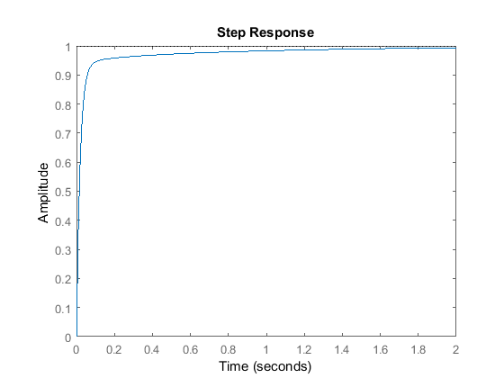
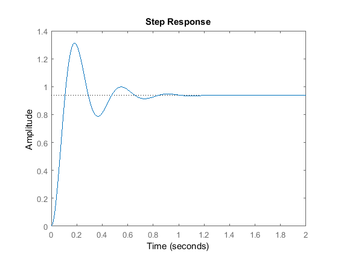
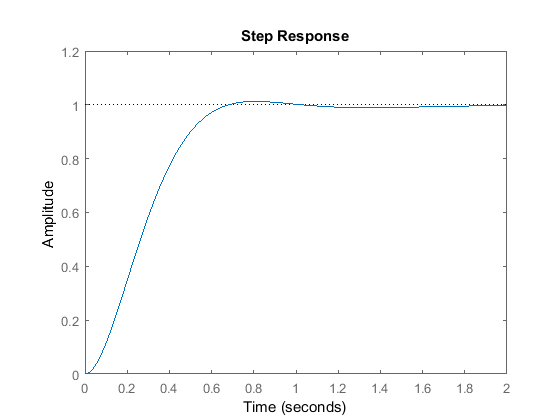
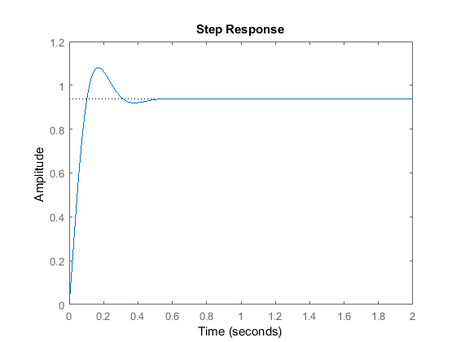
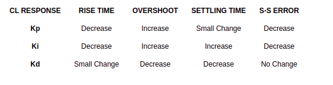

# CarND-Controls-PID
This project implements a PID controller to determine the steering angle output for a car driving around a race track in simulation.


## PID Controller Overview
A PID controller is a common controller used for controlling actuation based off a desired goal and feedback coming from the system. PID controllers generally look at the error of the system (current state versus the desired state), and change the output signal based off the tuned PID parameters.

Throughout this explanation I will be using image references from The University of Michigan's [Control Tutorials PID page](http://ctms.engin.umich.edu/) under the Creative Commons Attribution-ShareAlike License. Check out their page for PID implementations using MATLAB.

Here is an exmple of well tuned PID controller may look like.


In this case, an Amplitude of 1 is the goal, and we are able to quickly get within range of the goal without any overshoot.

#### P - Proportional
The proportional gain portion of the controller scales the output signal with the error signal. If my error signal increases 2x, the controller will try twice as hard to achieve the desired state. The proportional gain is the backbone of the PID controller, but it tends to create an oscillating signal, overshoot the desired state, and does not react to external disturbances very gracefully.

Below is a simulated Proportional controller. The dotted line represents the desired state.



Imagine this graph represents the altitude of a drone. If the dotted line was the desired altitude we wanted it to fly at, this graph shows we are doing so very inefficiently, and would probably have a short battery run time because so much energy is spent trying to correct the position. There is also a lot of overshoot, which in some applications may be dangerous (over exceeding physical limits). An example would be if we were flying the drone in an enclosed space with a roof, we might accidentally crash into it.

#### I - Integral
A integral in calculus can be used to find the area under the curve. Since our controller is monitoring the signal over time, the integral portion of a PID heavily affected by time. It essentially takes a look at how much error there has been over time, so if there has been a lot of error recently, heavily amplify the signal such that it leans towards the objective. If there hasn't been a lot of error recently, then decrease the amount of signal change output. An example of implementing a Integral parameter to our proportional controller in the above section can be seen below.



Notice how overshoot was drastically decreased. However, also note that it increased the time it took for the signal to "settle". One thing to note is including the integral term tends to increase performance of your PID controller really well if working in an environment with varying external disturbances, or if there are biases/offsets in your signal.

#### D - Derivative
A derivative in calculus is used to find the rate of change function. The derivative parameter of a PID controller is used to monitor the rate of change of the error. The below image is when we had a derivative portion to out proportional controller that was shown in the Proportional section.




In comparison to proportional alone, the derivative parameter helped decrease the overshoot, and settled quicker.

## Tuning PID Parameters  
The parameters for a PID controller with vary greatly from application to application. The biggest factor to take into account will be the order of magnitude your error is expressed in. If your error signal is on a scale from -1000 to 1000, and your output signal is a voltage between 0-5 volts, you may have really small PID values (or consider normalizing values to better match your signal range). Another influencer of your PID controller values is what you plan to achieve/prioritize with the controller (ex: minimize overshoot, decrease time to achieve steady state, etc).  Below is a table of what effect occurs when you increase each parameter in a PID.



Here S-S Error stands for Steady State error, which refers to the error when the system reaches equilibrium (experiences little to no change in amplitude). This table is a good reference when tuning your PID. For example, if I was seeing heavy overshoot in my system, I may be inclined to decrease the proportional, decrease the integral, and increase the derivative parameters in my PID controller. If I fix my overshoot problem, but want to decrease the rise time, I may be inclined to increase my proportional and integral parameters even more, but leave the derivative parameter where it is.  

## Implementing PID In This Project
The PID in this project is implements to following parameter values:

| Parameter  | Value  |
|-|-|
| Proportional  |  0.13 |
| Integral  | 0.005  |
| Derivative | 0.7  |

Implementing the Integral portion (even incredibly small values) mainly lead to longer oscillation times, and a delay in settling, causing the car to not be prepared if a sharp turn came up.The proportional value mainly plays the role of ensuring the car can turn enough, is relevance to the error, too little a value cause the car to not turn enough and fall off the road, too large a value caused the car to overturn causing huge oscillation which spanned larger than the lane width. Increasing the derivative parameter helped with dampening the oscilations and allow for smoother turning. My PID code can be viewed in `PID.cpp`.

A video of the car completing the entire simulation track can be viewed in `videos/PID_project.mp4`

---

## Dependencies

* cmake >= 3.5
 * All OSes: [click here for installation instructions](https://cmake.org/install/)
* make >= 4.1(mac, linux), 3.81(Windows)
  * Linux: make is installed by default on most Linux distros
  * Mac: [install Xcode command line tools to get make](https://developer.apple.com/xcode/features/)
  * Windows: [Click here for installation instructions](http://gnuwin32.sourceforge.net/packages/make.htm)
* gcc/g++ >= 5.4
  * Linux: gcc / g++ is installed by default on most Linux distros
  * Mac: same deal as make - [install Xcode command line tools]((https://developer.apple.com/xcode/features/)
  * Windows: recommend using [MinGW](http://www.mingw.org/)
* [uWebSockets](https://github.com/uWebSockets/uWebSockets)
  * Run either `./install-mac.sh` or `./install-ubuntu.sh`.
  * If you install from source, checkout to commit `e94b6e1`, i.e.
    ```
    git clone https://github.com/uWebSockets/uWebSockets
    cd uWebSockets
    git checkout e94b6e1
    ```
    Some function signatures have changed in v0.14.x. See [this PR](https://github.com/udacity/CarND-MPC-Project/pull/3) for more details.
* Simulator. You can download these from the [project intro page](https://github.com/udacity/self-driving-car-sim/releases) in the classroom.


## Basic Build Instructions

1. Clone this repo.
2. Make a build directory: `mkdir build && cd build`
3. Compile: `cmake .. && make`
4. Run it: `./pid`.
